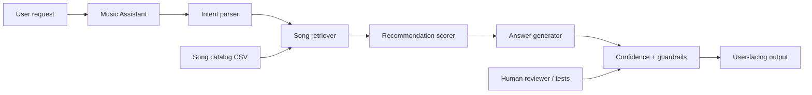

# System Architecture

```mermaid
flowchart LR
    A[User request] --> B[Music Assistant]
    B --> C[Intent parser]
    C --> D[Song retriever]
    D --> E[Recommendation scorer]
    E --> F[Answer generator]
    F --> G[Confidence + guardrails]
    H[Song catalog CSV] --> D
    I[Human reviewer / tests] --> G
    G --> J[User-facing output]
```
 